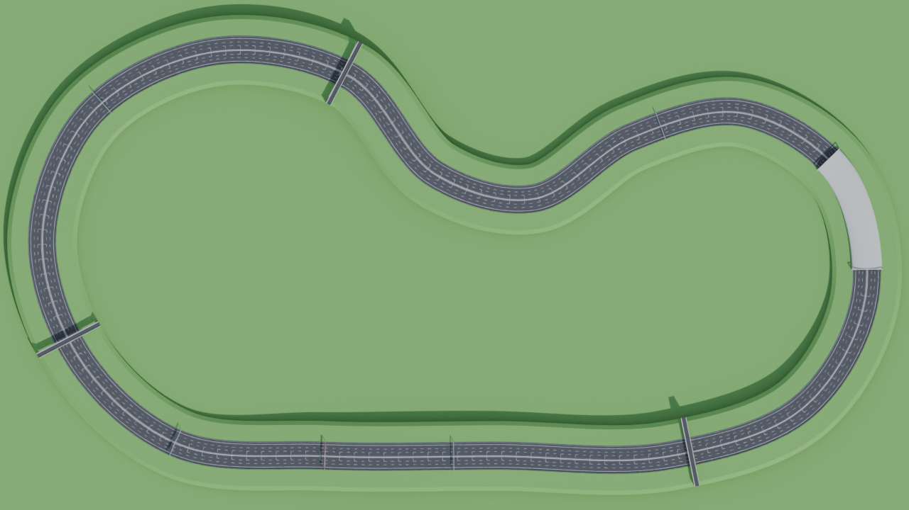
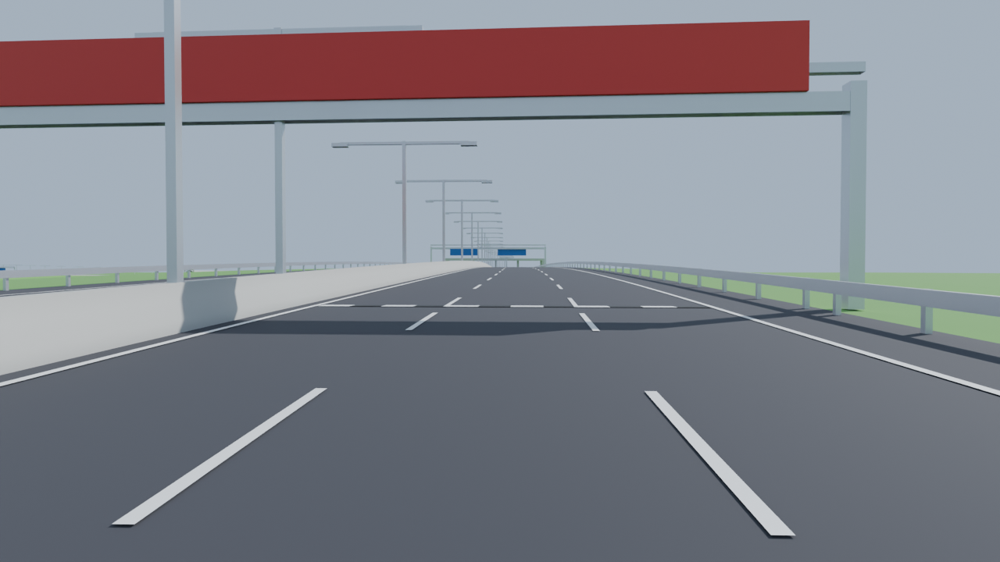
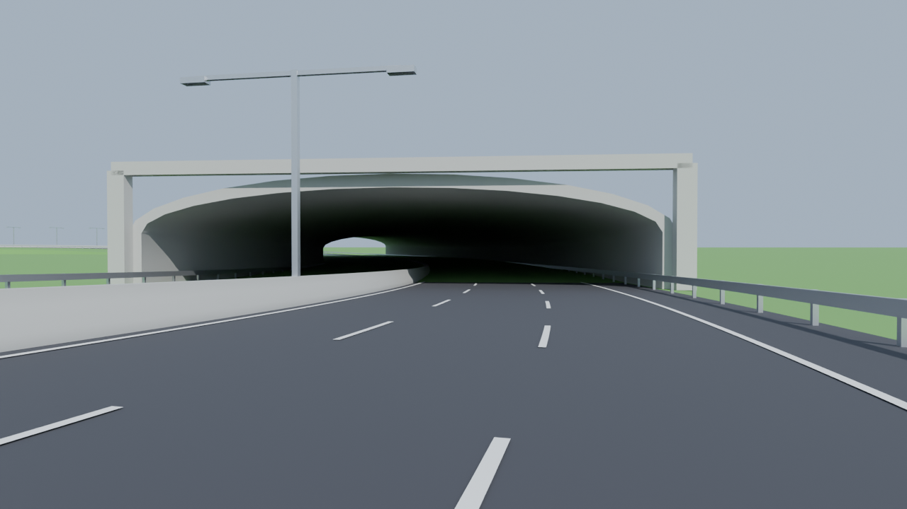
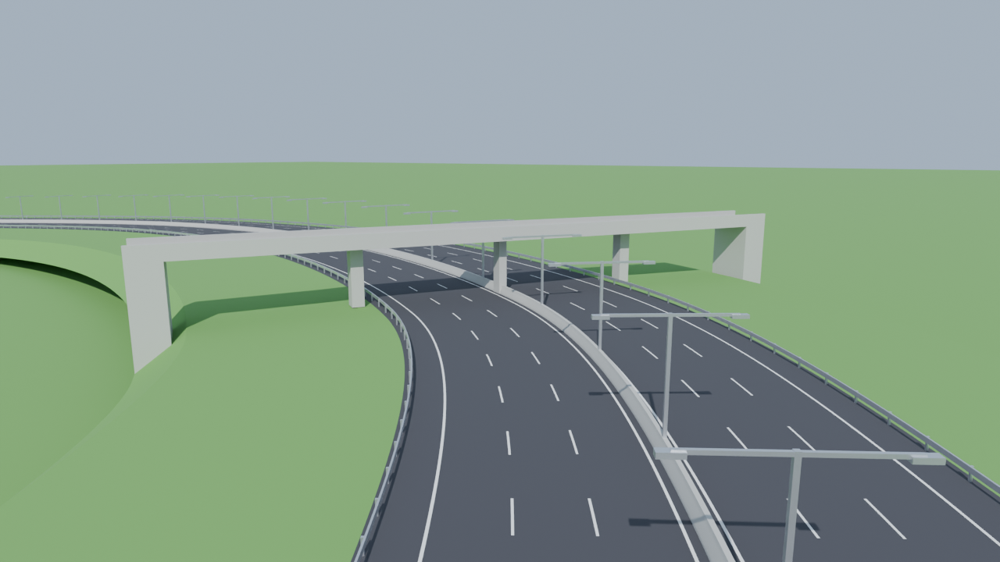

# Roll a Meme – Autobahn-Strecke (Ghost-Driver-Stil)

Großer Autobahn-Rundkurs, gebaut mit Blender, für Roblox.



| Start/Ziel | Tunnel | Brücke |
|---|---|---|
|  |  |  |

## Was drin ist

- **8.778 Studs** Rundkurs (geschlossen, man kann endlos fahren)
- **2 × 3 Spuren** à 14 Studs plus Standstreifen, Mittelleitwand aus Beton → Gegenverkehr wie bei Ghost Driver
- Weite Kurven (engster Radius 202 Studs), S-Kurven, sanfte Hügel
- Tunnel, 3 Brücken über die Autobahn, 4 Schilderbrücken, Laternen, Leitplanken
- Start/Ziel-Linie mit Zielflagge-Muster und rotem Banner
- `TrackLanes.lua`: Wegpunkte für alle 6 Spuren, damit KI-Autos in ihrer Spur fahren können

## Dateien

| Datei | Zweck |
|---|---|
| `export/Autobahn.fbx` | In Roblox Studio importieren |
| `export/Autobahn.blend` | In Blender weiter bearbeiten |
| `export/TrackLanes.lua` | ModuleScript mit Spur-Wegpunkten und Spawnpunkt |
| `blender/autobahn_strecke.py` | Generator: Strecke anpassen und neu erzeugen |

## In Roblox importieren

1. Studio → **Avatar/Model → Import 3D** → `export/Autobahn.fbx`
2. Unter den Import-Einstellungen bei **File Dimensions / Scale Unit** die Option **Studs** wählen (1 Blender-Einheit = 1 Stud).
3. Danach im importierten Model alle Teile markieren → `Anchored = true`.
4. Kollision:
   - `Asphalt_*`, `Beton_*`, `Gras_*`, `Metall_*`: `CollisionFidelity = PreciseConvexDecomposition`
   - `Markierung_*`, `Schwarz_*`, `Schild_*`, `Banner_*`: `CanCollide = false`
5. Materialien setzen (Teile sind nach Material benannt): `Asphalt_*` → Asphalt, `Beton_*` → Concrete, `Gras_*` → Grass, `Metall_*` → DiamondPlate/Metal.
6. `TrackOrigin` ist ein kleiner Würfel am Streckenursprung. Nicht löschen, nur `Transparency = 1` und `CanCollide = false` setzen. Er wird für die Wegpunkte gebraucht.

## Wegpunkte für Verkehr (Ghost Driver)

`export/TrackLanes.lua` als ModuleScript in `ReplicatedStorage` legen:

```lua
local TrackLanes = require(game.ReplicatedStorage.TrackLanes)
local track = workspace.Autobahn

-- Spieler-Spawn
local startCF = TrackLanes.StartCFrame(track)

-- Spur 2 in Fahrtrichtung "Forward" (rechte Fahrbahn)
for _, p in TrackLanes.Forward[2] do
	local worldPos = TrackLanes.ToWorld(track, p)
	-- KI-Auto zu worldPos fahren lassen …
end
```

`Forward` = rechte Fahrbahn (gleiche Richtung wie der Start), `Backward` = Gegenfahrbahn.
Jede Liste ist in Fahrtrichtung sortiert und wiederholt sich als Schleife. Für den Ghost-Driver-Effekt
fährt der Spieler auf der Gegenfahrbahn, die Verkehrsautos folgen `Backward` bzw. `Forward`.

## Strecke ändern

Oben in `blender/autobahn_strecke.py` lassen sich `CONTROL_POINTS` (Streckenform), Spuranzahl/-breite,
Tunnel-, Brücken- und Schilderpositionen ändern. In Blender: **Scripting → Öffnen → Run Script**.
Neu exportieren (headless):

```sh
blender -b -P blender/autobahn_strecke.py -- --export export
```
